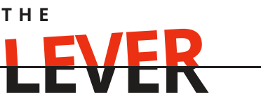

# <picture><source media="(prefers-color-scheme: dark)" srcset=".github/assets/logo-dark.svg"><source media="(prefers-color-scheme: light)" srcset=".github/assets/logo-light.svg"></picture>

**The Lever** is a crisis-intervention companion for addiction recovery. No sobriety counters, no meeting finder, no sponsor contact list — just a fast path from "I need it now" to a matched coping technique: a five-question forced-choice triage, an instrument picked against your profile and what's actually held for you before, a timed step-by-step run, and an outcome check-in that either reinforces what worked or falls back to a harm-reduction screen.

This repo is a React/Vite single-page app that emulates the mobile experience inside an iOS device frame, for showcasing the product.

**Live:** https://kirtom.github.io/the-lever/ (custom domain `thelever.help` planned)

## Contents

- [Stack](#stack)
- [Getting started](#getting-started)
- [Structure](#structure)
- [Data model](#data-model)
- [Lever choice mechanic](#lever-choice-mechanic)
- [Levers library](#levers-library)
- [Deployment](#deployment)

## Stack

- React 18 + Vite
- No backend — profile, instrument scores, and the private log persist to `localStorage` only. Nothing syncs, nothing is shared.

## Getting started

```bash
npm install
npm run dev      # local dev server
npm run build    # production build to dist/
npm run preview  # preview the production build
```

## Structure

```
src/
  data.js           instrument library, profile-step and SOS-question definitions
  useLever.js        state machine + recommendation logic (matching, scoring, timers)
  App.jsx            screen router inside the iOS device frame
  components/         IOSDevice frame, Logo, Hoverable
  screens/            one component per screen (welcome, profile, home, SOS, …)
design/                the original Claude Design handoff — chat transcripts and the
                        HTML/CSS/JS prototype this app was built from. Not part of the
                        shipped app; kept for provenance and future design iteration.
```

## Data model

Everything the app knows lives in five entities, defined in `src/data.js` and held together by the `useLever` hook (`src/useLever.js`): Profile, SOS Answers, the Instrument/Lever library, Scores, and History. Three of the five — Profile, Scores, and History — persist to `localStorage` under a single key, `the-lever:v1`. SOS Answers are session-only by design (a crisis session is about tonight, not a history of every past crisis); the Instrument library itself is static content defined in source, not user state at all.

### Profile (persisted)

Set once during onboarding (`PROFILE_STEPS` in `data.js`, five screens), re-editable any time from "Your profile" → "Redo profile creation." Shape:

```js
{ subs: [], triggers: [], worked: [], ruledOut: [], treatment: [] }
```

| Field | Profile screen | Feeds into |
|---|---|---|
| `subs` | 01 — The substance | Nothing yet — `substanceRelevance` matching exists in the algorithm but is unpopulated across the library (see [Lever choice mechanic](#lever-choice-mechanic)). Currently informational only, shown on the profile view. |
| `triggers` | 02 — The trigger | Tier 3 structural-affinity scoring, via each instrument's `triggerTags` |
| `worked` | 03 — What works for you | Seeds initial `Scores` at profile completion, via each instrument's `worksForKey` |
| `ruledOut` | 04 — Never suggest this | Tier 1 hard filter, via `RULE_BLOCK` — the only field with veto power |
| `treatment` | 05 — Medication and health | Nothing yet — collected and shown on the profile view; no instrument currently reads it |

### SOS Answers (session-only)

Re-collected every time the HELP! flow runs, one value per dimension, from the five `QUESTIONS` in `data.js`:

```js
{ place, mag, emotion, body, time }
```

`mag` is self-reported intensity ("How loud is it?", 1–3 through 9–10) and `time` is how long the person has right now. Deliberately not persisted — a crisis session is about tonight, not a history of every past crisis.

### Instrument / Lever

The core content entity — one object per row in `INSTRUMENTS` (`data.js`):

| Field | Type | Purpose |
|---|---|---|
| `id` | string | Stable slug, used everywhere else as a foreign key (`worksForKey`, `RULE_BLOCK` values, `Scores` keys) |
| `name` | string | Display name on the Instrument and shelf screens |
| `framework` | string | Shown under the name; the source technique/tradition |
| `frameworkNote` | string | Expandable footnote — the fuller provenance explanation |
| `why` / `does` | string | "Why this one" / "What it does" copy on the Instrument screen |
| `duration` | string | Display string ("90 seconds", "4 minutes") — should sum to the `steps[].t` total |
| `steps` | `{ t, label, body }[]` | Drives the timed Run screen; `t` is seconds, counted down live |
| `tags` | `{ place[], mag[], emotion[], body[], time[] }` | Situational matching against tonight's SOS Answers — Tier 2 |
| `triggerTags` | string[] | Matches `profile.triggers` — Tier 3 |
| `worksForKey` | string \| null | The one `profile.worked` option this instrument represents, if any |
| `substanceRelevance` | string[] | Matches `profile.subs` — Tier 3. Empty on every instrument today; see the gap noted above |
| `originOrg` | string | Who/what this is sourced from |
| `evidenceTier` | `'established'` \| `'emerging'` | `'established'` = clinically-trialed modality; `'emerging'` = philosophy-sourced or newer-research, honestly, even where it inspired real clinical technique |
| `reviewStatus` | string | Currently `'drafted'` on every instrument — none of this content has had an actual clinical review pass |

`RULE_BLOCK` is the hard-filter map: `{ [ruledOutOptionLabel]: [instrumentId, ...] }`. Selecting that option in profile step 4 removes those instruments from candidacy entirely, no matter how well they'd otherwise score.

### Scores (persisted, "the learned tier")

```js
{ [instrumentId]: [holds, attempts] }
```

Written by exactly two things: the `worked`-seeding step at profile completion (see below), and real outcomes — "It came down" increments both `holds` and `attempts`, "Still climbing" increments only `attempts`. Nothing else ever writes here. The Home screen's "Your levers" shelf is a read-only view over this: instruments with `attempts > 0`, sorted by hold rate then attempt count, top 5.

### History (persisted, "the private log")

An array of `{ when, name, detail, outcome, ok }` entries, newest first, shown on the "Private log" screen. Three outcome kinds: **Success** / **Failure** (from an SOS run) and **Relapse** (from the harm-reduction screen's "Log tonight as a relapse"), rendered as a visually distinct ink chip rather than a third value on the same success/failure scale. Starts empty — no seeded demo data.

## Lever choice mechanic

`pickInstrument` in `src/useLever.js` runs every time the HELP! flow resolves (after the fifth SOS question) or "Give me a different one" is tapped. It scores every non-excluded instrument and returns the winner. Four tiers, in order of how much they can move the outcome:

**Tier 1 — Hard filter (veto).** `profile.ruledOut` → `RULE_BLOCK` removes matching instruments from candidacy before scoring starts. Absolute: a ruled-out instrument can never be picked, no matter its score.

**Tier 2 — Situational match (dominant signal).** For each of tonight's five SOS answers, if the instrument's `tags` for that dimension include the answer:
- `mag` or `time` match → **+3**
- `place`, `emotion`, or `body` match → **+2**

Intensity and available time are weighted 1.5× higher than context — the algorithm treats "how bad is it and how long do you have" as the dominant question, everything else as secondary.

**Tier 3 — Structural affinity (small, capped).** Overlap between `profile.triggers` and the instrument's `triggerTags` → **+1 per match, capped at +2**. Overlap between `profile.subs` and `substanceRelevance` → **+1, capped at +1** (currently always 0 — see the Data model gap above). Deliberately small: background pattern should nudge, not compete with tonight's actual answers.

**Tier 4 — Learned (small, capped).** `(holds / attempts) × 1.5` from `Scores`. An instrument with zero attempts contributes 0 — no assumption of effectiveness before it's been tried.

**Tie-break.** An earlier version of this algorithm broke exact ties by array order — whichever instrument was defined first in `data.js` always won, which silently made every instrument added after an existing tie permanently unreachable (caught and fixed while building the second content batch; see git history on `feature/levers-batch-2-*`). The fix: collect every instrument tied for the top score, then pick whichever has the fewest logged attempts (surfaces under-tried instruments over well-worn ones), then break any remaining tie at random.

**Seeding.** When profile creation finishes, for every instrument whose `worksForKey` matches a selected `profile.worked` answer — and that doesn't already have real attempts logged — `Scores[id]` is seeded to `[1, 2]` (a 50% prior). This is why the shelf isn't cold on day one for someone who just told the app what's worked before; real outcomes dilute the seed fast.

**Selection.** Highest total score wins among survivors. "Give me a different one" adds the current pick to a session-only `rejected` list and reruns the same scoring against the same five answers, minus that option — it cascades to the next-best fit rather than re-triaging from scratch.

## Levers library

31 instruments across 20 frameworks. Every instrument carries `reviewStatus: 'drafted'` — none of this content has had an actual clinical review pass. `evidenceTier` is `'established'` for content from a clinically-trialed modality (DBT, CBT, MBRP, SMART Recovery, ACT, standard behavioural technique) and `'emerging'` for content sourced from a philosophical or newer-research tradition, even where it inspired or overlaps with established clinical technique.

Full source: [`src/data.js`](src/data.js).

### Dialectical Behaviour Therapy (DBT)

**Cold Water, Then One Breath** (`tipp`)
- **Duration:** 90 seconds (3 steps)
- **Why this one:** At a 9 you cannot be talked out of anything, so this doesn't try. Cold on the face triggers the mammalian dive reflex and drops your heart rate inside sixty seconds. It buys the ninety seconds where a decision becomes possible again.
- **Flow:** Cold water on your face → Breathe out longer than you breathe in → Sit down and say the time out loud
- **Matches on:** place: `Home alone`, `Outdoors alone`, `Out in public`, `At work` · mag: `9–10`, `7–8` · body: `Wired`, `Shaky or sick`, `Heart racing`, `Sweating`, `Tense` · time: `Two minutes`, `Five minutes`
- **Trigger affinity:** `Withdrawal`, `Physical pain`
- **Seeded by:** profile answer `Cold water` in "What has actually worked before?"
- **Source:** Marsha Linehan / DBT Skills Training Manual · `evidenceTier: 'established'`

**Stop. Then Decide** (`stop`)
- **Duration:** 90 seconds (4 steps)
- **Why this one:** The urge to act is fastest right when it starts. This doesn't try to talk you out of it — it puts four short steps between the impulse and your hands, which is often enough for the next choice to stop being automatic.
- **Flow:** Stop. Freeze exactly where you are → Take a step back → Observe what's actually happening → Proceed mindfully
- **Matches on:** place: `Home alone`, `Out in public`, `At work`, `Outdoors alone` · mag: `7–8`, `9–10` · body: `Wired`, `Heart racing` · time: `Two minutes`
- **Trigger affinity:** `Wanting a reward`, `Easy money`, `Sexual arousal`
- **Source:** Marsha Linehan / DBT Skills Training Manual · `evidenceTier: 'established'`

**The Distraction List** (`accepts`)
- **Duration:** 4 minutes (3 steps)
- **Why this one:** When the craving is loud but not a full physiological flood, out-arguing it rarely works — out-occupying it does. This gives your attention somewhere else to go that isn't willpower.
- **Flow:** Pick one thing, not five → Do it with your hands or your body → Keep going until the edge is off
- **Matches on:** place: `Home alone`, `Home with other people`, `At work` · mag: `4–6`, `7–8` · emotion: `Boredom`, `Restlessness` · time: `Five minutes`, `Ten minutes`
- **Trigger affinity:** `Boredom`, `Tiredness`
- **Source:** Marsha Linehan / DBT Skills Training Manual · `evidenceTier: 'established'`

**Something For Every Sense** (`soothe`)
- **Duration:** 5 minutes (4 steps)
- **Why this one:** Numbness and emptiness don't respond well to arguments — they respond to input. This gives every sense something ordinary and real on purpose.
- **Flow:** Sight and sound → Touch and smell → Taste, last → Notice what changed
- **Matches on:** place: `Home alone`, `Home with other people` · mag: `4–6` · emotion: `Emptiness`, `Boredom` · body: `Numb`, `Exhausted` · time: `Five minutes`, `Ten minutes`
- **Trigger affinity:** `Boredom`, `Loneliness`
- **Source:** Marsha Linehan / DBT Skills Training Manual · `evidenceTier: 'established'`

**This Is What's True Right Now** (`accept`)
- **Duration:** 6 minutes (4 steps)
- **Why this one:** Some cravings are fused to a fact you can't change tonight — a loss, a diagnosis, a relationship that's over. Fighting the fact keeps the craving fed. This doesn't ask you to be at peace with it, only to stop spending the fight on the wrong target.
- **Flow:** Say the fact, not the story → Notice what you're fighting → Accept it without agreeing with it → Ask what's next, given that
- **Matches on:** mag: `4–6`, `7–8` · emotion: `Grief`, `Anger`, `Shame` · time: `Ten minutes`, `Thirty minutes`
- **Trigger affinity:** `Physical pain`
- **Source:** Marsha Linehan / DBT Skills Training Manual · `evidenceTier: 'established'`

### Mindfulness-Based Relapse Prevention (MBRP)

**Urge Surfing** (`surf`)
- **Duration:** 6 minutes (4 steps)
- **Why this one:** Cravings have a shape. Yours peaks and falls in about twenty minutes whether or not you act on it. This makes the falling part visible so the peak stops feeling permanent.
- **Flow:** Find where it lives in your body → Rate it, then wait → Rate it again → Ride it down
- **Matches on:** place: `Home alone`, `Home with other people` · mag: `4–6`, `7–8` · emotion: `Anxiety`, `Anticipation`, `Boredom`, `Restlessness` · time: `Ten minutes`, `Thirty minutes`
- **Trigger affinity:** `Boredom`, `Wanting a reward`
- **Blocked by:** "Anything over ten minutes" (ruled out in profile step 4)
- **Source:** Alan Marlatt & Sarah Bowen / Mindfulness-Based Relapse Prevention · `evidenceTier: 'established'`

**The SOBER Space** (`sober`)
- **Duration:** 3 minutes (5 steps)
- **Why this one:** You don't have twenty minutes right now and you don't need them — this is the version that fits into a bathroom stall or a parking lot. Five steps, all of them short.
- **Flow:** Stop → Observe → Breathe → Expand → Respond
- **Matches on:** place: `At work`, `Out in public` · mag: `4–6`, `7–8` · time: `Two minutes`, `Five minutes`
- **Trigger affinity:** `Tiredness`, `Environment cues`
- **Source:** Sarah Bowen / Mindfulness-Based Relapse Prevention · `evidenceTier: 'established'`

**Three Minutes, Head To Toe** (`scan`)
- **Duration:** 4 minutes (4 steps)
- **Why this one:** Some of this isn't in your head right now — it's in your shoulders, your jaw, your stomach. This finds where it's actually sitting instead of arguing with a thought that isn't the real problem.
- **Flow:** Feet and legs → Stomach and chest → Shoulders, jaw, hands → The whole body, at once
- **Matches on:** place: `Home alone`, `Home with other people` · body: `Numb`, `Tense`, `Exhausted` · time: `Five minutes`, `Ten minutes`
- **Trigger affinity:** `Tiredness`, `Physical pain`
- **Source:** Sarah Bowen / Mindfulness-Based Relapse Prevention · `evidenceTier: 'established'`

### SMART Recovery

**The Fifteen-Minute Deal** (`delay`)
- **Duration:** 15 minutes (3 steps)
- **Why this one:** You never agreed to quit tonight. You agreed to fifteen minutes, which is a promise you can actually keep, and cravings rarely survive being made to wait with something in your hands.
- **Flow:** Set fifteen minutes. Say the deal out loud → Put something in your hands → When it runs out, re-rate it
- **Matches on:** mag: `4–6`, `1–3` · emotion: `Boredom`, `Emptiness` · body: `Numb`, `Exhausted`, `In pain` · time: `Thirty minutes`, `As long as it takes`
- **Trigger affinity:** `Boredom`, `Wanting a reward`, `Easy money`
- **Seeded by:** profile answer `Waiting it out` in "What has actually worked before?"
- **Blocked by:** "Anything over ten minutes" (ruled out in profile step 4)
- **Source:** SMART Recovery (DEADS) · `evidenceTier: 'established'`

**The Two-Column Truth** (`cba`)
- **Duration:** 5 minutes (3 steps)
- **Why this one:** Right now you're only running the benefit column in your head — the relief, the quiet, the reward. This makes you write the cost column too, in your own words, before you act instead of at 3am after.
- **Flow:** Short-term benefit, in your own words → Cost, in your own words → Put them side by side
- **Matches on:** mag: `4–6`, `7–8` · emotion: `Anticipation`, `Boredom` · time: `Five minutes`, `Ten minutes`
- **Trigger affinity:** `Wanting a reward`, `Boredom`
- **Source:** SMART Recovery · `evidenceTier: 'established'`

**Trace It Back** (`abc`)
- **Duration:** 6 minutes (4 steps)
- **Why this one:** It feels like the event caused this — but the event happened to everyone in the room and only you are standing here. It's the belief in between that's doing the damage, and beliefs are the one part of this you can actually catch and question.
- **Flow:** Name the activator → Name the belief → Name the consequence → Question the belief, not the event
- **Matches on:** mag: `4–6`, `7–8` · emotion: `Anger`, `Shame`, `Guilt` · time: `Ten minutes`
- **Trigger affinity:** `Anger`, `Hunger`
- **Source:** SMART Recovery (adapted from REBT / Albert Ellis) · `evidenceTier: 'established'`

### Cognitive Behavioural Therapy (CBT)

**Play The Tape Forward** (`tape`)
- **Duration:** 4 minutes (4 steps)
- **Why this one:** It feels good right now — that is why this one is dangerous. The craving is showing you the first ten minutes and hiding the next fourteen hours. You are going to watch the whole thing.
- **Flow:** First ten minutes. Say it out loud → Hour three → Tomorrow, 7am → Now the other reel
- **Matches on:** place: `Somewhere I used to use`, `Home alone` · mag: `4–6`, `7–8` · emotion: `Anticipation`, `Boredom`, `Emptiness`, `Guilt` · time: `Five minutes`, `Ten minutes`
- **Trigger affinity:** `Wanting a reward`, `Easy money`
- **Source:** Standard CBT relapse-prevention (decisional balance) · `evidenceTier: 'established'`

**Catch The Thought** (`catch`)
- **Duration:** 5 minutes (4 steps)
- **Why this one:** The thought driving this — "I can't handle this," "everyone does this," "just this once" — sounds true because it's fast and it's yours. Slow it down onto paper and it usually loses some of its authority.
- **Flow:** Write the thought, word for word → Write the evidence for it → Write the evidence against it → Write a truer thought
- **Matches on:** mag: `4–6` · emotion: `Shame`, `Guilt`, `Fear` · time: `Five minutes`, `Ten minutes`
- **Trigger affinity:** `Anger`, `Loneliness`
- **Seeded by:** profile answer `Writing it down` in "What has actually worked before?"
- **Source:** Standard CBT thought-record practice · `evidenceTier: 'established'`

**If This, Then That** (`ifthen`)
- **Duration:** 3 minutes (3 steps)
- **Why this one:** You're standing in the exact situation you're worst at deciding in. This isn't asking you to decide right now — it's asking you to write down the decision so future-you doesn't have to make it from scratch.
- **Flow:** Name the exact trigger → Write the if-then, out loud → Do the "then" part now
- **Matches on:** place: `Out in public`, `At work` · mag: `4–6`, `7–8` · time: `Two minutes`, `Five minutes`
- **Trigger affinity:** `Environment cues`, `Easy money`
- **Source:** Standard CBT practice (implementation intentions) · `evidenceTier: 'established'`

### Acceptance and Commitment Therapy (ACT)

**Just A Thought, Passing By** (`defuse`)
- **Duration:** 4 minutes (4 steps)
- **Why this one:** You're not going to out-argue "I need this" — it doesn't respond to logic because it isn't a logical claim, it's a craving wearing a sentence. This doesn't fight it. It just relabels what it actually is.
- **Flow:** Name the thought exactly → Add four words in front of it → Say it in a stupid voice → Let it sit there, don't argue
- **Matches on:** mag: `4–6`, `7–8` · emotion: `Anticipation`, `Anxiety` · time: `Five minutes`
- **Trigger affinity:** `Wanting a reward`, `Sexual arousal`
- **Source:** Acceptance and Commitment Therapy practice · `evidenceTier: 'established'`

**What This Actually Costs** (`values`)
- **Duration:** 6 minutes (4 steps)
- **Why this one:** Willpower fuelled by fear runs out — it's why "rock bottom" motivation never lasts on its own. This asks a different question: not what you're scared of, but who you're actually trying to be. That one holds up longer.
- **Flow:** Name one person you don't want to let down → Name what kind of person you're trying to be → Ask if this gets you closer or further → Pick one thing that moves you toward it
- **Matches on:** mag: `4–6` · emotion: `Emptiness`, `Grief` · time: `Ten minutes`, `Thirty minutes`
- **Trigger affinity:** `Boredom`, `Loneliness`
- **Source:** Acceptance and Commitment Therapy practice · `evidenceTier: 'established'`

### Stimulus control (behavioural)

**Leave The Room** (`leave`)
- **Duration:** 3 minutes (3 steps)
- **Why this one:** You are standing in the place. No technique out-argues a cue this loud — everything else works better from two hundred metres away. Move first, think second.
- **Flow:** Stand up. Now → Two hundred metres, any direction → Text one person that you left
- **Matches on:** place: `Somewhere I used to use`, `Out in public` · mag: `7–8`, `9–10` · time: `Two minutes`, `Five minutes`, `Ten minutes`
- **Trigger affinity:** `Environment cues`
- **Seeded by:** profile answer `Getting outside` in "What has actually worked before?"
- **Blocked by:** "Outdoor or sport activities" (ruled out in profile step 4)
- **Source:** Behavioural stimulus-control literature (cue exposure) · `evidenceTier: 'established'`

### Trauma-informed grounding

**5–4–3–2–1** (`ground`)
- **Duration:** 3 minutes (4 steps)
- **Why this one:** You're in public and shaking. This one is invisible — nobody standing next to you will know you are doing it, and it works on anxiety faster than it works on craving.
- **Flow:** Five things you can see → Four you can feel → Three you can hear → Two you can smell, one you can taste
- **Matches on:** place: `Out in public`, `At work` · mag: `4–6`, `7–8` · emotion: `Anxiety`, `Shame`, `Fear` · body: `Wired`, `Shaky or sick`, `Nauseous`, `Tense` · time: `Two minutes`, `Five minutes`
- **Trigger affinity:** `Physical pain`, `Withdrawal`
- **Source:** Trauma-informed grounding practice · `evidenceTier: 'established'`

### Social support (twelve-step adjacent)

**One Call, Script Written** (`call`)
- **Duration:** 5 minutes (3 steps)
- **Why this one:** The reason this fails is never willingness, it's not knowing what to open with — so the opening line is written for you and you only have to press call.
- **Flow:** Read the line → Press call before you edit it → Say where you are
- **Matches on:** place: `Home alone`, `Outdoors alone` · mag: `7–8`, `9–10` · emotion: `Shame`, `Grief`, `Emptiness`, `Loneliness` · time: `Ten minutes`, `Thirty minutes`, `As long as it takes`
- **Trigger affinity:** `Loneliness`
- **Seeded by:** profile answer `Calling someone` in "What has actually worked before?"
- **Blocked by:** "Talking to a person" (ruled out in profile step 4)
- **Source:** Peer-support / twelve-step-adjacent social support literature · `evidenceTier: 'established'`

### Behavioural (sleep as endpoint)

**Cut The Night Short** (`night`)
- **Duration:** 20 minutes (3 steps)
- **Why this one:** You're exhausted with the whole night ahead of you and no reason to still be awake. Nothing good is coming at 2am. Ending the day is a win, not a surrender.
- **Flow:** Phone on the far side of the room → Shower as hot as you can stand → Bed, lights off, something spoken
- **Matches on:** place: `Home alone`, `Outdoors alone` · mag: `1–3`, `4–6` · body: `Exhausted`, `Numb` · time: `Thirty minutes`, `As long as it takes`
- **Trigger affinity:** `Tiredness`
- **Blocked by:** "Anything over ten minutes" (ruled out in profile step 4)
- **Source:** Behavioural sleep-as-endpoint literature · `evidenceTier: 'established'`

### Stoic philosophy

**Sort What You Can Actually Move** (`control`)
- **Duration:** 4 minutes (4 steps)
- **Why this one:** Most of what's driving this isn't actually in your hands right now — the day, the mood, what already happened. Some tiny piece of it is. This finds that piece and puts everything else down for a minute.
- **Flow:** List what's not yours to move → Find the one thing that is → Put the rest down, on purpose → Do the one small thing
- **Matches on:** mag: `4–6`, `7–8` · emotion: `Anger`, `Fear`, `Anxiety` · time: `Five minutes`
- **Trigger affinity:** `Anger`, `Physical pain`
- **Source:** Stoic philosophy (Epictetus) — informs modern CBT/REBT but not itself a clinical modality · `evidenceTier: 'emerging'`

### Logotherapy

**This Moment Has Weight** (`meaning`)
- **Duration:** 4 minutes (4 steps)
- **Why this one:** The craving is telling you this moment doesn't matter, it's just an obstacle to get past. Frankl's whole argument was the opposite: how you handle exactly this kind of moment is where meaning actually gets made, not despite the difficulty but inside it.
- **Flow:** Name what this moment is actually testing → Name who is affected by how this goes → Say what getting through this would mean → Act like this moment matters, because it does
- **Matches on:** mag: `4–6` · emotion: `Emptiness`, `Grief`, `Boredom` · time: `Five minutes`, `Ten minutes`
- **Trigger affinity:** `Boredom`, `Loneliness`
- **Source:** Viktor Frankl — Logotherapy · `evidenceTier: 'emerging'`

### Existentialism / Process Philosophy

**Not A Sentence, A Sentence In Progress** (`identity`)
- **Duration:** 4 minutes (4 steps)
- **Why this one:** "I'm an addict" and "I always do this" feel like facts about who you are. They're not — they're a description of what you've chosen before, and what you choose next is still open. This isn't positive thinking. It's just accurate: the sentence isn't finished.
- **Flow:** Say the label you're using on yourself → Notice it's a pattern, not a fact → Say what you're choosing right now instead → Let that choice be the whole point
- **Matches on:** mag: `4–6`, `7–8` · emotion: `Shame`, `Guilt` · time: `Five minutes`
- **Trigger affinity:** `Withdrawal`, `Anger`
- **Source:** Jean-Paul Sartre (existentialism) and Alfred North Whitehead (process philosophy) — philosophical framing, not a clinical modality · `evidenceTier: 'emerging'`

### Relapse-prevention research / Buddhist 'Middle Way'

**One Slip Isn't The Whole Story** (`allornothing`)
- **Duration:** 3 minutes (3 steps)
- **Why this one:** "I already messed up, might as well keep going" is the single most well-documented trap in relapse research. It's not really about the craving anymore — it's about an all-or-nothing rule you set for yourself that one imperfect moment just broke.
- **Flow:** Name the all-or-nothing rule → Say what's actually true → Separate the slip from the spiral
- **Matches on:** mag: `4–6`, `7–8` · emotion: `Guilt`, `Shame` · time: `Two minutes`, `Five minutes`
- **Trigger affinity:** `Easy money`, `Wanting a reward`
- **Source:** Alan Marlatt — relapse-prevention research on the abstinence violation effect · `evidenceTier: 'established'`

### Pragmatism / habit science

**Keep The Cue, Swap The Response** (`habitloop`)
- **Duration:** 4 minutes (4 steps)
- **Why this one:** You're not going to delete the cue that just fired — it's already here. What's actually still open is what happens next. Same trigger, same reward you're chasing, different action in between.
- **Flow:** Name the cue → Name the reward you're actually chasing → Pick a different action for the same reward → Do it now, in place of the old routine
- **Matches on:** place: `Home alone`, `Out in public`, `At work` · mag: `4–6` · time: `Five minutes`, `Ten minutes`
- **Trigger affinity:** `Environment cues`, `Boredom`
- **Source:** William James (pragmatism) and modern habit-loop behavioural science · `evidenceTier: 'established'`

### Socratic method

**Deconstruct The Line You're Telling Yourself** (`myth`)
- **Duration:** 5 minutes (4 steps)
- **Why this one:** There's a specific sentence running right now — "I've earned this," "I can stop whenever," "this one doesn't count." It sounds like a fact because you've heard it from yourself a hundred times. It hasn't earned that. Cross-examine it like you would anyone else's claim.
- **Flow:** State the line exactly → Ask: is this actually true, or just familiar? → Ask: what would I tell someone else who said this? → Ask what the line is actually for
- **Matches on:** mag: `4–6` · emotion: `Loneliness`, `Shame` · time: `Five minutes`, `Ten minutes`
- **Trigger affinity:** `Loneliness`, `Withdrawal`
- **Source:** Socratic method, applied as in cognitive-behavioural restructuring · `evidenceTier: 'established'`

### Behavioural Activation

**Do The Small Thing First** (`activation`)
- **Duration:** 3 minutes (4 steps)
- **Why this one:** You're waiting to feel like doing something else before you do it. That's backwards — the feeling usually shows up after the action starts, not before. This isn't asking for a plan. It's asking for the smallest possible next physical action.
- **Flow:** Pick the smallest possible action → Do just that one thing → Notice what shifted → Pick the next small thing
- **Matches on:** emotion: `Boredom`, `Emptiness` · body: `Numb`, `Exhausted` · time: `Two minutes`, `Five minutes`
- **Trigger affinity:** `Boredom`, `Tiredness`
- **Source:** Standard behavioural activation practice; smallest-next-action framing informed by Taoist wu wei · `evidenceTier: 'established'`

### Progressive Muscle Relaxation

**Tense It, Then Let It Go** (`pmr`)
- **Duration:** 5 minutes (4 steps)
- **Why this one:** Telling your body to "just relax" doesn't work — it's not a switch. This works because you tense on purpose first, so the release afterward is real instead of forced.
- **Flow:** Hands and arms → Shoulders and face → Stomach and chest → Legs and feet
- **Matches on:** place: `Home alone`, `Home with other people` · body: `Tense`, `Wired`, `Shaky or sick` · time: `Five minutes`, `Ten minutes`
- **Trigger affinity:** `Physical pain`, `Withdrawal`
- **Source:** Edmund Jacobson — Progressive Muscle Relaxation · `evidenceTier: 'established'`

### Episodic future thinking

**Picture The Actual Morning** (`eft`)
- **Duration:** 4 minutes (4 steps)
- **Why this one:** The craving is only showing you right now. This doesn't argue with it — it just adds a second, equally vivid scene: a specific morning, in detail, that either does or doesn't have this in it.
- **Flow:** Pick one exact future moment → Fill in the real details → Put today's decision inside that scene → Hold both scenes side by side
- **Matches on:** mag: `4–6` · emotion: `Anticipation`, `Guilt` · time: `Five minutes`, `Ten minutes`
- **Trigger affinity:** `Wanting a reward`, `Easy money`
- **Source:** Episodic future thinking research in addiction and delay-discounting (Bickel, Snider, and related work) · `evidenceTier: 'emerging'`

### Secularized twelve-step

**Hand This One Off** (`turnover`)
- **Duration:** 3 minutes (3 steps)
- **Why this one:** You've been trying to win this one alone, on willpower, and it isn't holding. That's not a character failure — some moments are bigger than one person gritting their teeth. This is about redirecting the effort, not giving up: from "fight it alone" to "get this moment some help."
- **Flow:** Admit this one is bigger than willpower alone → Name what "handing it off" looks like tonight → Do that one thing
- **Matches on:** mag: `7–8`, `9–10` · emotion: `Shame`, `Grief`, `Emptiness` · time: `Two minutes`, `Five minutes`
- **Trigger affinity:** `Withdrawal`, `Physical pain`
- **Blocked by:** "Religious or spirituality talk" (ruled out in profile step 4)
- **Source:** Secularized adaptation of twelve-step 'turning it over' · `evidenceTier: 'emerging'`

### Directive coaching (blunt register)

**Stop Negotiating With Yourself** (`toughlove`)
- **Duration:** 2 minutes (3 steps)
- **Why this one:** You've been negotiating with yourself for the last few minutes, and every round of that negotiation is time spent moving closer, not further. This isn't going to ask how you feel about it. Stop arguing with yourself and do the next line.
- **Flow:** Stop the negotiation → Say what you're actually doing instead, out loud → Do it. Now.
- **Matches on:** mag: `7–8`, `9–10` · emotion: `Anticipation` · time: `Two minutes`
- **Trigger affinity:** `Boredom`, `Easy money`
- **Blocked by:** "Tough love" (ruled out in profile step 4)
- **Source:** Directive coaching style, precedented in SMART Recovery's confrontational tradition and behavioural activation's 'act first' principle · `evidenceTier: 'emerging'`

## Deployment

Pushes to `main` deploy automatically via `.github/workflows/deploy.yml` to GitHub Pages. `vite.config.js` uses relative asset paths (`base: './'`) so the same build works unmodified at the current GitHub Pages project path and, once attached, at the root of the `thelever.help` custom domain.
